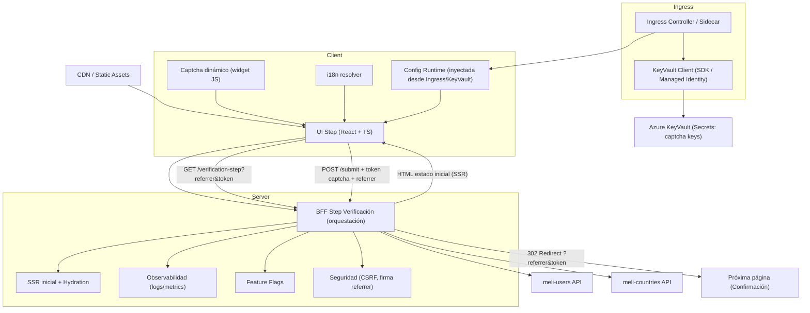
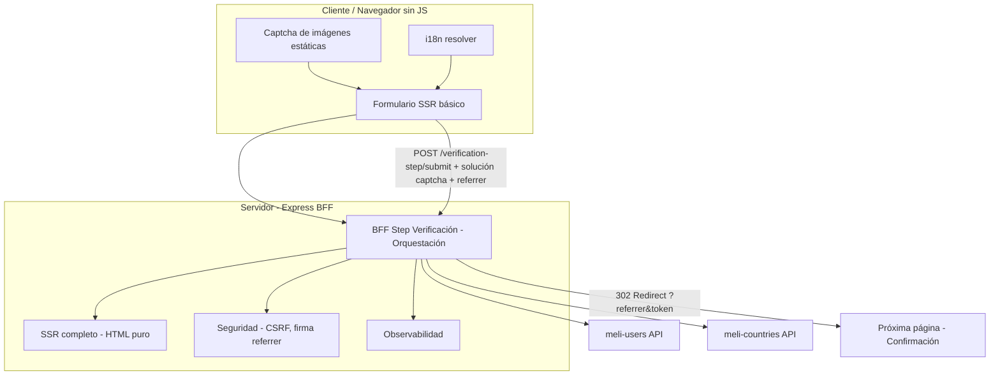
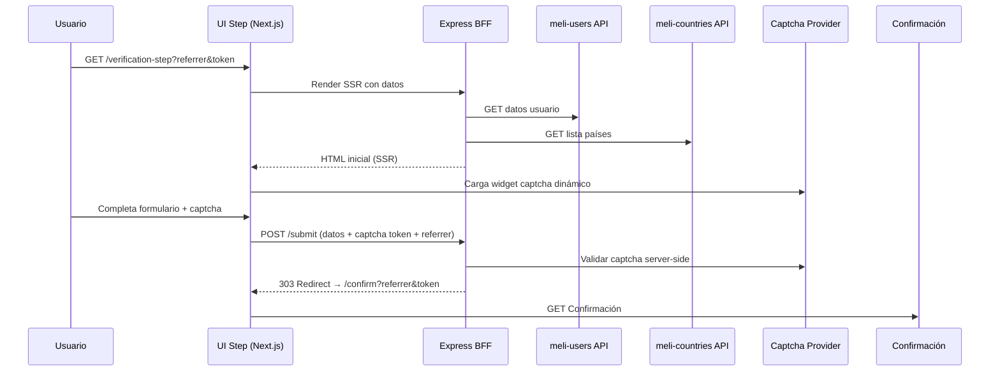
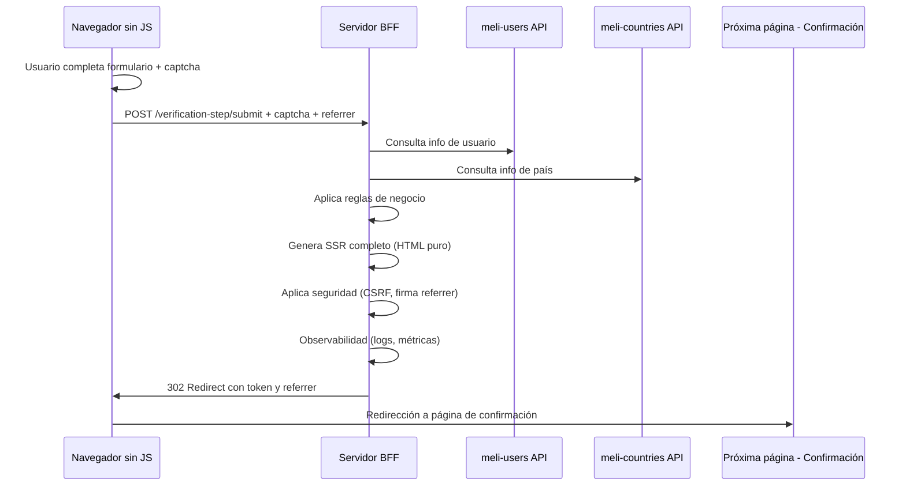

# mf-abuse-prevention-react-next

**Autor:** [Carlos Andrés Felipe Beltrán Triana]

[](https://nodejs.org) [](https://www.npmjs.com) 

[](https://www.Nextjs.com)
[](https://www.React.com)

## 1. Introducción
  Este microfrontend está construido en React bajo el framework de Next.js v15.5.0 y se denomina `mf-abuse-prevention-react-next`. El presente microfrontend está diseñado para presentar una solución ante los errores presentados para las compras.

### 1.1. Objetivo
  El presente microfrontend busca mostrar dos opciones ante los posibles errores antes de realizar una compra, la primera se realiza bajo JS, dejando toda la responsabilidad del captcha al frontend y la segunda presenta una alternativa con Html vainilla que busca limitar la carga a componentes basicos.

## 2. Información de la solución.
- **Funcionalidad principal:** Este microfrontend muestra una pantalla inicial donde se mostrará un formulario que permitira verificar los datos del usuario, y su previa verificación ante el API de meli-users.

### Especificaciones técnicas
- **Lenguaje de programación:** NodeJs 20.10.0
- **Framework:** Next.js 15.5.0
- **Contenedor:** Docker

## 3. Modelos de arquitectura

### 3.1. Arquitectura de alto nivel

#### 3.1.1. Arquitectura modelo con uso de JS


| Componente                | Rol                                                                                       |
| ------------------------- | ----------------------------------------------------------------------------------------- |
| **UI Step (React/TS)**    | Renderiza formulario, validación inmediata, integra captcha dinámico.                     |
| **Captcha dinámico (JS)** | Previene automatización; validado también en backend.                                     |
| **i18n resolver**         | Selección de idioma por dominio, fallback `Accept-Language`.                              |
| **BFF Step Verificación** | Orquesta datos de `meli-users` y `meli-countries`, aplica reglas de negocio, prepara SSR. |
| **SSR inicial**           | Entrega HTML + estado inicial, soporta fallback sin JS.                                   |
| **Observabilidad**        | Logs, métricas de latencia, tasa de éxito captcha, trazabilidad.                          |
| **Seguridad**             | Validación de referrer, firmas de parámetros, KeyVault.                                |


#### 3.1.2. Arquitectura modelo sin uso de JS



| Componente                           | Rol                                                                                                |
| ------------------------------------ | -------------------------------------------------------------------------------------------------- |
| **Formulario SSR básico**            | Renderiza formulario sin JS, integra captcha de imágenes estáticas y se adapta a i18n.             |
| **Captcha de imágenes estáticas**    | Previene automatización de manera visual; validación enviada al backend.                           |
| **i18n resolver**                    | Determina idioma según dominio o `Accept-Language`.                                                |
| **BFF Step Verificación**            | Orquesta datos de `meli-users` y `meli-countries`, aplica reglas de negocio, prepara SSR completo. |
| **SSR completo - HTML puro**         | Genera y entrega HTML con estado inicial, sin depender de JS en cliente.                           |
| **Seguridad - firma referrer** | Valida referrer.                                             |
| **Observabilidad**                   | Monitorea logs, métricas de latencia y trazabilidad del flujo de verificación.                     |
| **meli-users API**                   | Provee información de usuarios necesaria para la verificación.                                     |
| **meli-countries API**               | Provee datos de países para reglas de negocio y localización.                                      |
| **Próxima página - Confirmación**    | Página destino tras completar verificación; recibe redirect con token y referrer.                  |

### 3.2. Diagrama de secuencia
#### 3.2.1. Modelo con uso de JS

### 3.2.2. Modelo sin uso de JS


##  4. Contratos
### 4.1. Get /verification-step
  ```json
  {
    "user": {
      "id": "string",
      "name": "string",
      "address": {
        "street": "string",
        "city": "string",
        "country": "string",
        "zip": "string"
      }
    }
  }
  ```
**Descripción user**
| Campo             | Tipo   | Descripción                     |
| ----------------- | ------ | ------------------------------- |
| `id`              | string | Identificador único del usuario |
| `name`            | string | Nombre completo del usuario     |
| `address.street`  | string | Calle de la dirección           |
| `address.city`    | string | Ciudad                          |
| `address.country` | string | País                            |
| `address.zip`     | string | Código postal                   |


### 4.2. Post /verification-step/submit
  ```json
  {
    "token": "string",
    "referrer": "/previous-step",
    "data": {"address": {"...": "..."}}
  }
  ```
## 5. Seguridad
  - **Validaciones del referrer:** Se recomienda realizar una validación y firma del referrer para evitar open-redirects.

  - **Verificación del token captcha:** Según el tipo de operación que se tome las validaciones del token del captcha o de la imagen estatica deben hacerse desde el servidor (server-side).

  - **Cabeceras obligatorias de seguridad:** Se propone implementar cabeceras de seguridad mediante el middleware para evitar que se haga ejecucción de scripts desde sitios ajenos.

  - **JWT con parametros de seguridad:** Para garantizar que los servicios sean cosnumidos unicamente en el momento que se necesitan y por quien debe ejcutarlos se propone agregar un authorization Bearer token que se valide mediante un mecanismo como ApiConnect o ApiManangment emitido por una entidad certificadora como Microsoft.

  - **Configuración de policies mediante ApiManagment o ApiConnect:** Para evitar un abuso sobre las verificaciones o un intento de ataque DOS se recomienda limitar el Rate Limiting y con ello hacer una detección de abuso a los servicios o el BFF.

## 6. Observabilidad
  -**Observación de métricas:** Se propone el uso de una herramienta como Grafana para auditar la latencia de lso servicios meli-users, meli-counters y hacer un servicio ping pong para verificar su correcto funcionamiento o inmediato reporte.
  Bajo la misma herramienta se propone verificar logs, o separar el proceso por dependencias en NewRelic o similares.
## 7. Testing
 - **Pruebas unitarias en Jest**: Se realizan pruebas unitarias sobre los componentes creados para verificar su funcionamiento y adaptabilidad.
 - **Revision de reglas automatizadas**: Se propone revisión del componente por medio de SonarQuebe y Fortify para verificar su correcto funcionamiento bajo las reglas EsLint, de seguridad y buenas practicas previamente pactadas.
## 8. Comparativa entre ambas soluciones.
| Aspecto       | Con JS (React + captcha dinámico)  | Sin JS (SSR + captcha imágenes) |
| ------------- | ---------------------------------- | ------------------------------- |
| UX            | Fluida, validación inline          | Básica, más pasos manuales      |
| Performance   | Mejor percepción, hydration rápida | Menos JS descargado             |
| Seguridad     | Captcha dinámico más robusto       | Captcha menos sofisticado       |
| Accesibilidad | Depende de proveedor captcha       | Puede adaptarse con HTML puro   |
| Complejidad   | Alta (JS + SSR + captcha API)      | Baja (solo SSR y backend)       |


